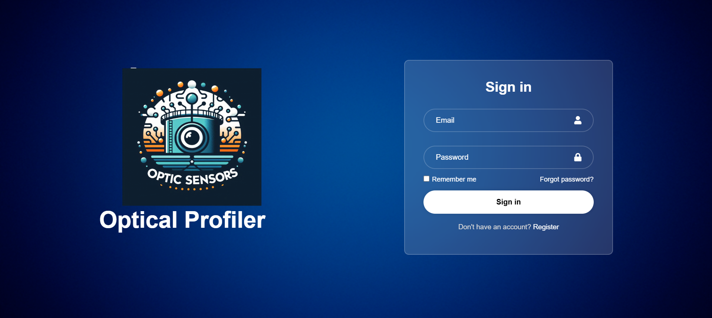
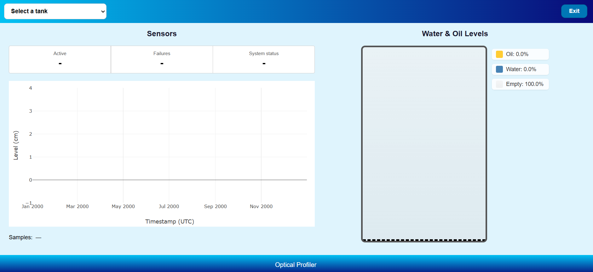
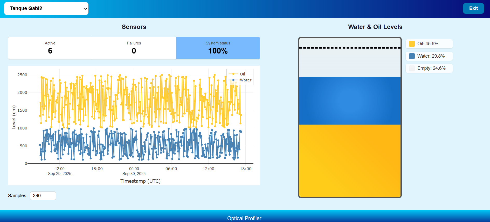

# Optical Profiler

Real-time web interface for monitoring oil and water levels in tanks using FBG (Fiber Bragg Grating) optical sensors.

## Preview

### Login


### Dashboard




## Tech stack

- [React 19](https://react.dev/)
- [Vite 6](https://vite.dev/)
- [Supabase](https://supabase.com/) — database and authentication
- [Plotly.js](https://plotly.com/javascript/) — interactive charts
- [React Router v7](https://reactrouter.com/)

## Features

- Login with Supabase Auth
- Tank selection dropdown
- Real-time water and oil level monitoring (5s polling)
- Historical level chart
- Visual tank diagram with operational capacity line
- FBG sensor status panel (active, failures, health %)

## Project structure
```
src/
├── assets/              # Static images and icons
├── components/          # React components (one .jsx + .css per component)
│   ├── Login.jsx / Login.css
│   ├── Home.jsx  / Home.css
│   ├── Graphic.jsx / Graphic.css
│   ├── Tank.jsx    / Tank.css
│   └── SensorStatus.jsx / SensorStatus.css
├── helper/
│   └── supabaseClient.js  # Centralized Supabase client instance
├── App.jsx / App.css
├── main.jsx
└── index.css
```

## Setup

### 1. Install dependencies
```bash
npm install
```

### 2. Configure environment variables
```bash
cp .env.example .env
```

Fill in your Supabase credentials in the `.env` file:
```
VITE_SUPABASE_URL=https://your-project.supabase.co
VITE_SUPABASE_ANON_KEY=your-anon-key-here
```

### 3. Run in development
```bash
npm run dev
```

### 4. Build for production
```bash
npm run build
```

## Database (Supabase)

The project expects the following tables:

| Table | Main columns |
|-------|-------------|
| `Tanque` | `pk_tanque`, `nome_tanque`, `altura_tanque`, `capacidade_operacional` |
| `Niveis` | `fk_tanque`, `nivel_agua`, `nivel_oleo`, `data` |
| `Lambdas` | `fk_tanque`, `lambda_medido`, `data` |

## Note

This project connects to a private Supabase database.
To run it locally you will need access to the database
or set up your own Supabase instance with the schema described above.